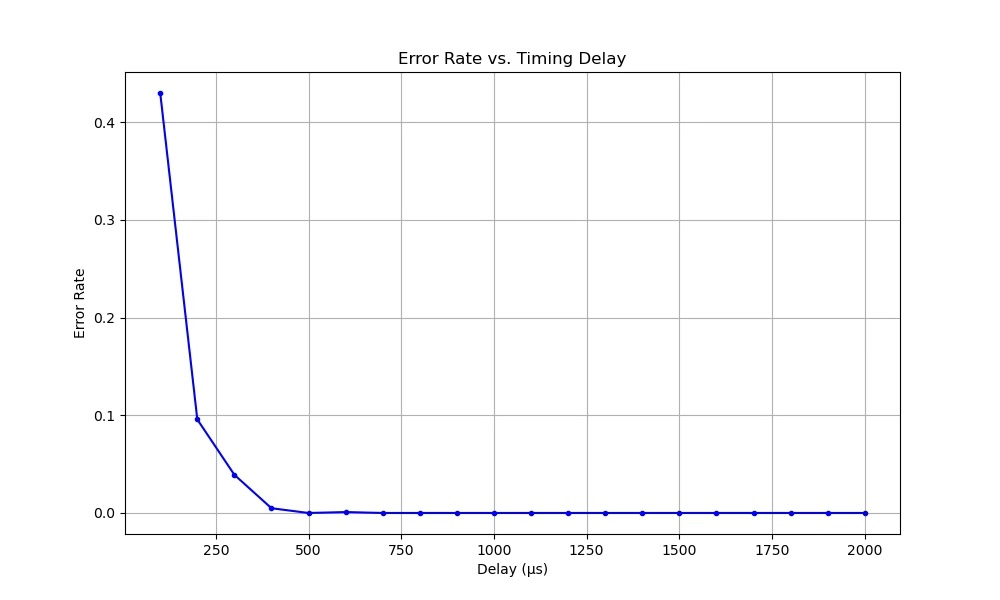

# Custom Serial Communication Protocol

A software-defined serial communication protocol that enables two Raspberry Pi systems to exchange structured messages over GPIO using bit-banging.

Instead of relying on hardware interfaces such as UART, SPI, or I²C, this project implements the physical and data link layers entirely in software. On top of the transport layer, it provides an HTTP-inspired application protocol that allows one Raspberry Pi to send structured GET and POST requests to another.

To simplify development and debugging, the project also includes a hardware bus monitor built from shift registers and LEDs that visualizes every transmitted byte in real time.


---

## Motivation

Most networking courses focus on higher-level protocols such as TCP and HTTP, while the physical and data link layers are often abstracted away by hardware.

The goal of this project was to explore how data is transmitted at the lowest levels by implementing a serial communication protocol from scratch. Rather than using dedicated communication peripherals, every clock transition and data bit is generated directly through GPIO, exposing many of the challenges involved in reliable digital communication.

---

## Features

* Software-defined serial communication protocol implemented using GPIO bit-banging
* Reliable communication between two Raspberry Pi Zero systems
* HTTP-inspired request/response application protocol
* Client/server architecture
* Interactive command-line client
* Real-time LED bus monitor for protocol visualization
* Automated transmission benchmarking and timing analysis

---

## Hardware

The project was implemented using:

* 2 × Raspberry Pi Zero
* Breadboards
* 74HC595 shift registers
* 8 LEDs
* Current-limiting resistors
* Jumper wires

Rather than connecting the two devices directly, the communication line passes through a hardware visualization module.

The module uses shift registers to convert the incoming serial bit stream into parallel output, displaying the current transmitted byte on eight LEDs. This provides immediate visual feedback during development and greatly simplified debugging timing and synchronization issues.

<p align="center">
  
</p>

---

## Software Design

The communication library exposes a simple API for creating serial connections over arbitrary GPIO pins.

```python
from comm import Comm

comm = Comm(data_pin=23, clock_pin=24)

comm.send_message(b"Hello")
message = comm.receive_message()
```

On top of the transport layer, the project implements an HTTP-inspired application protocol.

Example:

```http
GET /status HTTP/1.1
```

```http
POST /display HTTP/1.1
Content-Type: application/json
{
    "value": 42
}
```

This abstraction allows applications to communicate using structured requests instead of raw byte streams.

---

## Engineering Challenges

### Software Timing

Unlike UART or SPI, the protocol relies entirely on software timing.

Each transmitted bit requires carefully coordinated manipulation of both the data and clock GPIO lines. Small timing errors between the sender and receiver could result in dropped or corrupted bits.

Developing a reliable transmission protocol required careful experimentation with clock timing, synchronization, and GPIO edge sequencing.

### Hardware Debugging

Building the hardware introduced a number of practical challenges, including:

* Reading component datasheets
* Designing breadboard layouts
* Debugging wiring mistakes
* Floating inputs
* Signal integrity
* Shift register timing

The LED bus monitor became an invaluable debugging tool by allowing transmitted bytes to be inspected visually in real time.

---

## Performance Characterization

To improve reliability, I developed an automated benchmarking tool that repeatedly transmitted known data while varying the clock delay between GPIO transitions.

For each timing configuration, the benchmark measured transmission errors and generated plots showing the relationship between transmission speed and reliability.

This experimental approach allowed the protocol timing to be tuned empirically instead of relying on manual trial and error.



---

## What I Learned

This project provided hands-on experience with:

* Embedded systems
* GPIO programming
* Serial communication protocols
* Physical and data link layer networking
* Protocol design
* Client/server architectures
* Hardware debugging
* Timing-sensitive software development
* Experimental performance analysis
* Reading hardware datasheets and integrating digital components
